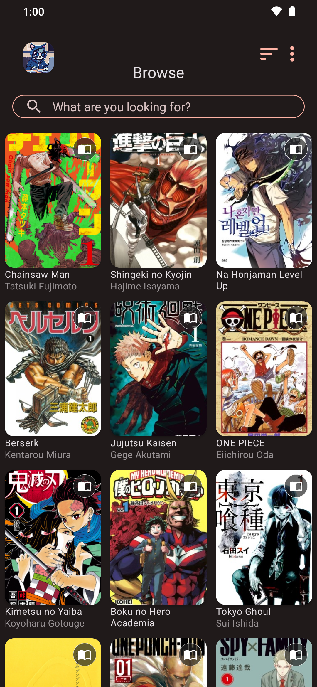
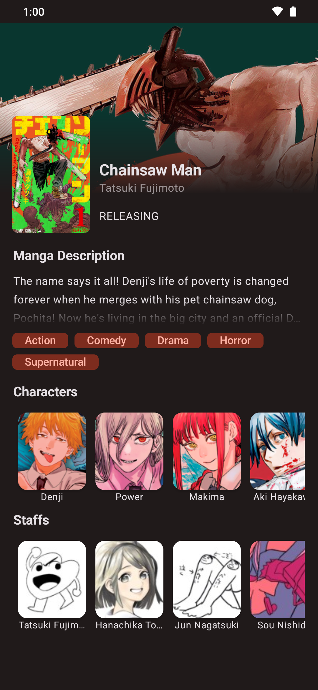
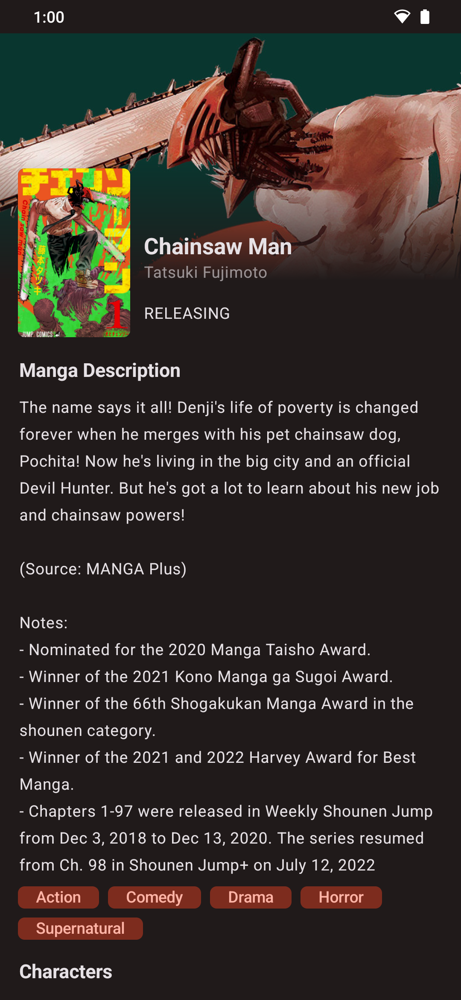

<h1 style="position: relative; height: 1.5em; line-height: 1.5;" class="readme-header">
    
         
    
    MoeKot (Moe + Kotlin)
</h1>

    
    
    

## Description

MoeKot is your go-to app for exploring, discovering, and curating your favorite manga and anime titles. With an intuitive interface and a touch of "Moe" (cute) inspiration, MoeKot enhances your browsing experience. Not only can you explore a vast collection of content, but future updates will also include a library feature for saving your favorite finds and tracking your reading/watching progress.

## Features

- **Manga and Anime Exploration:** Browse and discover a vast collection of Manga and Anime titles.
- **GraphQL API Integration:** Utilizes the Anilist.co GraphQL API for efficient and up-to-date content retrieval.
- **Cute Design:** Inspired by "Moe" (cute) culture, MoeKot provides a delightful user experience.

## Getting Started

### Installation

- Download APK file from the [release page]()

### Contribute

1. Fork this repo.
2. Open this repo in Android Studio: [Download and Install](https://developer.android.com/studio)
3. Create a new branch.
4. Make change and submit a pull request from your branch

## Acknowledgments

Special thanks to:
- [AniList](anilist.co) for hosting all the data and also providing the GraphQL API.
- [Apollo Kotlin](https://github.com/apollographql/apollo-kotlin) for the GraphQL client.
- [Coil](https://github.com/coil-kt/coil) for image fetching and caching.

I also use [Material3](https://m3.material.io/) for enhancing the overall design and user experience.

